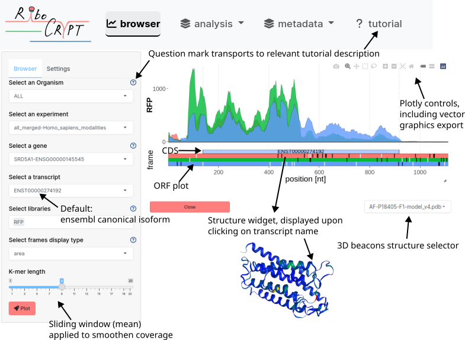

RiboCrypt: R Package for interactive visualization and browsing NGS data. 
==============================================================================


#### Online app
See our webpage containing thousands of Ribosome profiling datasets to explore!

[RiboCrypt.org](https://ribocrypt.org/)

#### Installation
We advice you to use github devel version, as this package is under
heavy development, to not lose out on new features!

Package is available from bioconductor (3.16, R version >= 4.0.0)
```r
if (!requireNamespace("BiocManager", quietly=TRUE))
    install.packages("BiocManager")
BiocManager::install("RiboCrypt")
```

Development version on bioconductor (3.17, R version >= 4.0.0)
```r
if (!requireNamespace("BiocManager", quietly=TRUE))
    install.packages("BiocManager")
BiocManager::install("RiboCrypt", version = "devel")
```  

Package is also available here on github
```r
if (!requireNamespace("devtools", quietly=TRUE))
    install.packages("devtools")
devtools::install_github("m-swirski/RiboCrypt")
```  

#### Tutorials

For extensive tutorials, see bioconductor help tutorials (vignettes):

- [Introduction to RiboCrypt](https://bioconductor.org/packages/devel/bioc/vignettes/RiboCrypt/inst/doc/RiboCrypt_overview.html)
