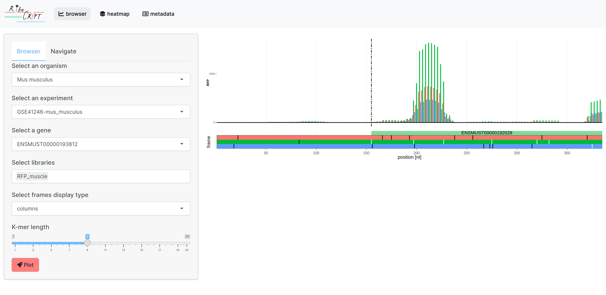
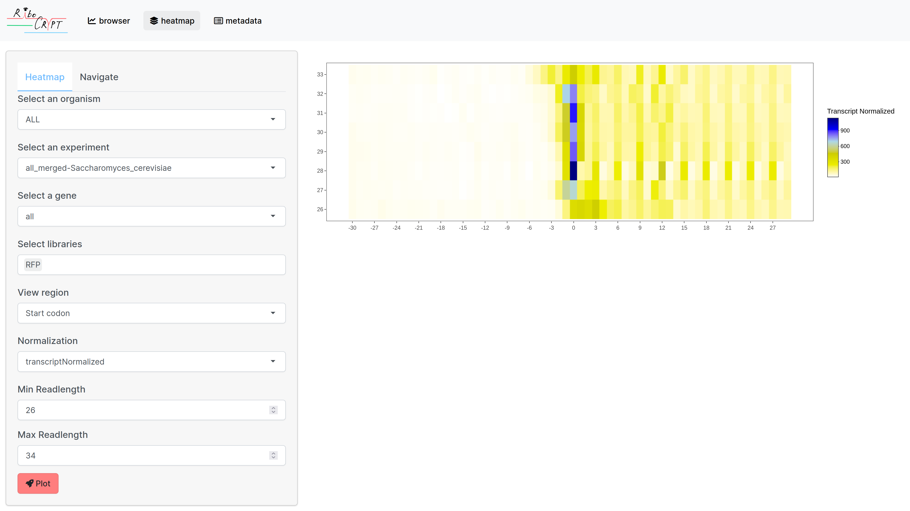

```{r setup, include=FALSE}
knitr::opts_chunk$set(echo = TRUE, fig.align = "left")
```

# Introduction

Welcome to `RiboCrypt` 
`RiboCrypt` is an R package for interactive visualization in genomics. `RiboCrypt` works with any NGS-based method, but much emphasis is put on Ribo-seq data visualization. 

This tutorial will walk you through usage of the app. 

`RibCrypt` app currently supports creating interactive browser views for NGS tracks, using
ORFik, Ribocrypt and massiveNGSpipe as backend.


# Browser {#browser}
The browser is the main coverage plot display page. 
It contains a click panel on the left side and display panels on the right.
It displays coverage of NGS data in either transcript coordinates (default),
or genomic coordinates (like IGV).
Each part will now be explained:

```{r, echo = FALSE, out.width = "1000px", out.height="500px", fig.align="left"}

```

## Display panel (browser)
The display panel shows the primary settings, (study, gene, sample, etc),
the possible select boxes are:

### Experiment selection {#exp}
- Select an organism: Either select "ALL" to keep all experiments, or select a specific organism to select display
only that subset of experiments in experiment select tab.
- Select an experiment: The experiments contain study names combined with organism (some studies
are multi species, so sometimes one study have multiple experiments). 
Select which one you want. There also exist merged experiments 
(all samples merged for the organism, etc)

### Gene selection {#gene}
- Select a gene: A gene can be selected currently using:
  - Gene id (ENSEMBL)
  - Gene symbol (hgnc, etc)
- Select a transcript: A transcript isoform of the given gene above, 
default is Ensembl canonical isoform. Can be selected using:
  - Transcript id (ENSEMBL)

### Library selection {#lib}
Each experiment usually have multiple libraries. Select which one
to display, by default if you select multiple libraries they will be shown
under each other.

Library are by default named:

- Library type (RFP, RNA etc),
- Condition (WT, KO (wild type, knock out ) etc)
- Stage/timepoint (5h, 1d (5 hours, 1 day) etc)
- fraction (chx, cytosolic, ATF4 (ribosomal inhibitor, cell fraction, gene) etc)
- replicate (technical/biological replicate number (r1, r2, r3))

The resuting name above could be:

- RFP_WT_5h_chx_cytosolic_r1

A normal thing to see is that if condition is KO (knockout), the fraction column
usually contains a gene name (the name of the gene that was knocked out)
Currently, best way to find SRR run number for respective sample is to go to
metadata tab and search for the study. 

### View mode {#linetype}
- Select frames display type: 
  - lines (single line, most clear for middle distance (> 100 nt))
  - columns (single point bars, most clear for single nt resolution)
  - stacks (Area under curve, stacked, most clear for long distance (> 1000 nt))
  - area (Area under curve, with alpha (see-through), most clear for long distance (> 1000 nt))
- K-mer length:
When looking at a large region (> 100nt), pure coverage can usually be hard to inspect.
Using K-mer length > 1 (9 is a good starting point to try), you can easily look at
patterns over larger regions. 

## Display panel (settings)
Here additional options are shown:

- 5' extension (extend viewed window upstream, outside defined region)
- 3' extension (extend viewed window downstream, outside defined region)
- Genomic View (Activate/deactivate genomic view, giving splice information and
correct positions in genome, but a lot harder to understand)
- Protein structures (If you click the annotation name of a transcript
in the plot panel it will display the alpha-fold protein colored by the ribo-seq data displayed
in the plot panel)
- Full annotation (display full annotation or just the tx you selected)
- Summary top track (Add an additional plot track on top, summarizing all selecte libs)
- Select Summary display type (same as frames display type above, but for the summary track)
- Export format (When you hover the plot top right image button, and click export 
(the camera button), which format to export as)


## Plot panel 
From the options specified in the display panel, when you press "plot" the data will be displayed.
It contains the specific parts:

1. Ribo-seq data (top), the single or multi-track data is displayed on top. By default
Ribo-seq is displayed in 3 colors, where 
 - red is 0 frame, the start frame of reference transcript.
 - green is +1 frame
 - blue is +2 frame 
2. Sequence track (top middle), displayes DNA sequence when zoomed in (< 100nt)
3. Annotation track (middle), the annotation track displays the transcript annotation, together
with black bars that is displayed on top of the data track.
4. Frame track (bottom), the 3 frames displayed with given color bars:
 - white  (Start codons)
 - black  (Stop codons)
 - purple (Custom motifs)
 When zoomed in, the amino acid sequence is displaced within each frame

# Analysis

Here we collect the analysis possibilities, which are usually
on whole genome scale.

## Codon analysis

This tab displays a heatmap of codons dwell times
over all genes selected, for both A and P sites.
When pressing "Differential" you swap to a between library
differential codon dwell time comparison (minimum 2 libraries selected is 
required for this method!)

### Display panel (codon)

Study and gene select works same as for browser specified above.
In addition to have the option to specify all genes (default).
- Select libraries (multiple allowed)

#### Filters {#codonfilt}
- Codon filter value (Minimum reads in ORF to be included)
- Codon score, all scores are normalized for both codon and count per
gene level (except for sum):
  - percentage (percentage use relative to max codon, 
    transcript normalized percentages)
  - dispersion(NB) (negative binomial dispersion values)
  - alpha(DMN) (Dirichlet-multinomial distribution alpha parameter)
  - sum (raw sum, (a very biased estimator, since some codons are used much 
    more than others!))

## Heatmap {#heatmap}

This tab displays a heatmap of coverage per readlength at a specific
region (like start site of coding sequences) over all genes selected. 

```{r, echo = FALSE, out.width = "1000px", out.height="500px", fig.align="left"}

```

### Display panel (heatmap)
Study and gene select works same as for browser specified above.
In addition to have the option to specify all genes (default).

- Select libraries
Only 1 library can be selected currently in heatmap mode.
- View region 
Select one of:
  - Start codon
  - Stop codon
- Normalization
Normalization mode for data display, select one of:
  - transcriptNormalized (each gene counts sum to 1)
  - zscore (zscore normalization, will give better overview if 1 readlength
  is extreme)
  - sum (raw sum of counts, is very sensitive to extreme peaks)
  - log10sum (log10 sum of counts, is less sensitive to extreme peaks)
- Min Readlength
 The minimum readlength to display from library
- Max readlength 
 The maximum readlength to display from library

### Display panel (settings)
Here additional options are shown:

- 5' extension (extend viewed window upstream from point, default 30)
- 3' extension (extend viewed window downstreamfrom point, default 30)

- Extension works like this, first extend to transcript coordinates.
- After gene end extend in genomic coordinates
- If chromosome boundary is reached, remove those genes from the full set.

## Differential gene expression {#diffexp}
Given an experiment with a least 1 design column with two values,
like wild-type (WT) vs knock out (of a specific gene),
you can run differential expression of genes.
The output is an interactive plot, where you
can also search for you target genes, making it more useable
than normal expression plots, which often are very hard to read.

### Display panel (Differential expression)
Organism and experiment explained above
- Differential method: FPKM ratio is a pure FPKM ratio calculation without
factor normalization (like batch effects), fast and crude check.
DESeq2 argument gives a robust version, but only works for experiments
with valid experimental design (i.e. design matrix must be full ranked, 
see deseq2 tutorial for details!)
- Select two conditions (which 2 factors to group by)

### Display panel (settings)
- draw unregulated (show dots for unregulated genes, makes it much slower!)
- Full annotation (all transcript isoforms, default is primary isoform only!)
- P-value (sliding bar for p-value cutoff, default 0.05)
- export format for plot (explained above)

## Meta Browser {#mbrowser}
Display all samples for a specific organism over selected gene.

### Display panel (Meta browser)
Organism, experiment and gene explained above
- Group on: the metadata column to order plot by
- K-means clusters: How many k-means clusters to use, if > 1, Group will be
sorted within the clusters, but K-means have priority.

### Display panel (settings)
- Normalization (all scores are tpm normalized and log scaled)
  - transcriptNormalized (each sample counts sum to 1) (default)
  - Max normalized (each position count divided by maximum)
  - zscore (zscore normalization, (count * mean / sd) variance scaled normalization)
  - tpm (raw tpm of counts, is very sensitive to extreme peaks)
- Color theme: Which color theme to use
- Color scale multiplier: how much to amplify the color signal (if all is single color, 
  try to reduce or increase this depending on which color is the majority)
- K-mer length: Smoothens out the signal by applying a mean sliding window, 
  default 1 (off)
  


### Requirements
This mode is very intensive on CPU, so it requires certain pre-computed results
for the back end.
That is namely:
- Premade collection experiments (an ORFik experiment of all experiments per organism)
- Premade collection count table and library sizes (for normalizations purpose)
- Premade fst serialized coverage calculation per gene (for instant loading of coverage over thousands of libraries)

Note that on the live app, the human collection (4000 Ribo-seq samples) takes
around 30 seconds to plot for a ~ 2K nucleotides gene, ~99% of the time is spent
on rendering the plot, not actual computation. Future investigation into optimization
will be done. 

## Read length (QC)

This tab displays a QC of pshifted coverage per readlength 
(like start site of coding sequences) over all genes selected. 

### Display panel (Read length QC)
The display panel shows what can be specified to display, the possible
select boxes are same as for heatmap above:

### Plot panel
From the options specified in the display panel, when you press "plot" the data will be displayed.
It contains the specific parts:

Top plot: Read length relative usage

1. Y-axis: Score
3. Color: Per frame (red, green, blue)
4. Facet box: the read length

Bottom plot:
Fourier transform (3nt periodicity quality, clean peak means good periodicity)

## Fastq (QC)

This tab displays the fastq QC output from fastp, as a html page.

### Display panel (Read length QC)
The display panel shows what can be specified to display, you can
select from organism, study and library.


### Plot panel
Displays the html page.

# Metadata

Metadata tab displays information about studies.

## Study accession number
 Here you input a study accession number in the form of either:
 
 - SRP
 - GEO (GSE)
 - PRJNA (PRJ....)
 - PRJID (Only numbers)

## Output
On top the abstract of the study is displayed, and on bottom a table
of all metadata found from the study is displayed.

# Additional information
All files are packed into ORFik experiments for easy access
through the ORFik backend package:

File formats used internally in experiments are:

- Annotation (gtf + TxDb for random access)
- Fasta genome (.fasta, + index for random access)
- Sequencing libraries (all duplicated reads are collapsed)
  - random access (only for collapsed read lengths): bigwig
  - Full genome coverage (only for collapsed read lengths): covRLE
  - Full genome coverage (split by read lengths): covRLElist
- count Tables (Summarized experiments, r data serialized .rds)
- Library size list (Integer vector, .rds)
- Precomputed gene coverages per organism: fst (used for metabrowser)

## massiveNGSpipe
For our webpage the processing pipeline used is massiveNGSpipe 
which wraps over multiple tools:

1.  Fastq files are download with ORFik download.sra
2.  Adapter is detected with either fastqc (sequence detection) and falls
    back to fastp auto detection. 
3.  Reads are then trimmed with fastp (using the wrapper in ORFik)
  - Adapter removal specified
  - minimum read size (20nt)
4.  Read are collapsed (get the set of unique reads and put duplication count in read header)
5. Reads are aligned with the STAR aligner (using the wrapper in ORFik), that supports
contamination removal. Settings: 
  - genomic coordinates (to allow both genomic and transcriptomic coordinates)
  - local alignment (to remove unknown flank effects)
  - minimum read size (20nt)
6. When all samples of study are aligned, an ORFik experiment is created that
connects each sample to metadata (condition, inhibitor, fraction, replicate etc)
7. Bam files are then converted to ORFik ofst format
8. These ofst files are then pshifted
9. Faster formats are then created (bigwig, fst and covRLE) for faster visualization

## Introduction to Ribo-seq

If you're not familiar with terms like "p-shifting" or "p-site offset", it's best to walk through ORFikOverview vignette, especially chapter 6 "RiboSeq footprints automatic shift detection and shifting"

https://bioconductor.org/packages/release/bioc/vignettes/ORFik/inst/doc/ORFikOverview.html#riboseq-footprints-automatic-shift-detection-and-shifting

## API for URL access and sharing

RiboCrypt uses the shiny router API system for creating runable links and backspacing etc.
The API specificiation is the following:

### Primary url:
https://ribocrypt.org/ (This leads to browser page)

### Page selection API:
Page selection is done with "#" followed by the page short name, the list 
is the following:

- broser page (/ or /#browser)
- heatmap (/#heatmap)
- codon (/#codon)
- Differential expression (/#Differential expression)
- Periodicity plot (/#periodicity)
- fastq QC report (/#fastq)
- MetaBrowser (/#MetaBrowser)
- SRA search (/#SRA search)
- Studies supported (/#Studies)
- This tutorial (/#tutorial)

Example: https://ribocrypt.org/tutorial sends you to this tutorial page

### Parameter API: 
Settings can be specified by using the standard web parameter API:

- "?", Starts the parameter specification
- "&", to combine terms:

Example: https://RiboCrypt.org/?dff=human_all_merged_l50&gene=ATF4-ENSG00000128272#browser
will lead you to browser and insert gene ATF4 (all other settings being default).

#### browser: 

- dff: experiment to select: for webpage it is "study id"_"Organism"
- gene: insert gene (symbol-ensembl gene id, if no symbol exist, only ensembl id)
- tx: isoform identifier, example "tx=ENST00000404241"

Example: https://RiboCrypt.org/?dff=human_all_merged_l50&gene=ATF4-ENSG00000128272&tx=ENST00000404241#browser
will lead you to browser and insert gene ATF4 (isoform: ENST00000404241).


## About

This app is created as a collaboration with:

- University of Warsaw, Poland
- University of Bergen, Norway

Main authors and contact:

- Michal Swirski (Warsaw), email: michal.swirski@uw.edu.pl
- Håkon Tjeldnes (Bergen), email: hauken_heyken@hotmail.com
