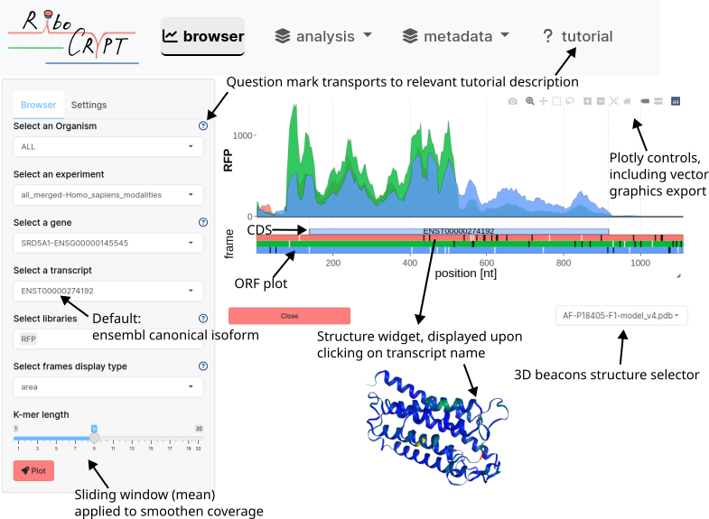
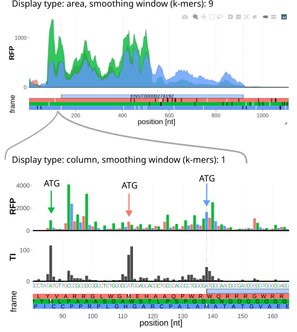
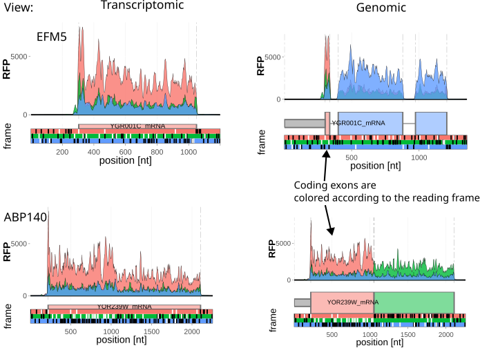
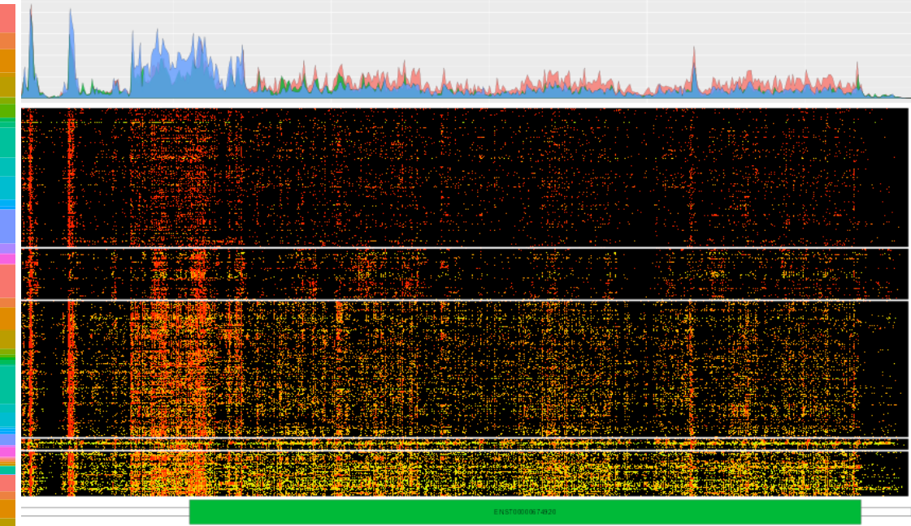
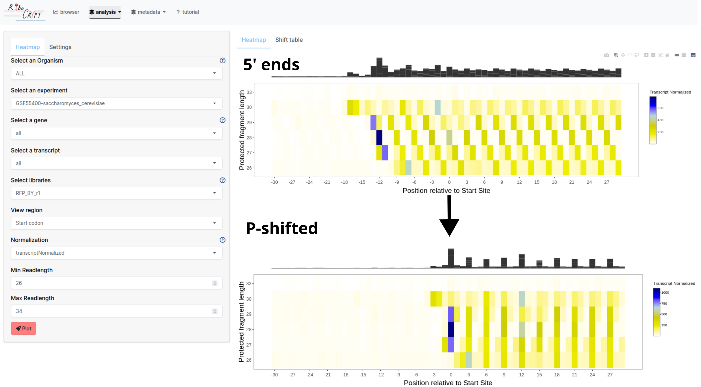

```{r setup, include=FALSE}
knitr::opts_chunk$set(echo = TRUE, fig.align = "left")
```

# Introduction

Welcome to `RiboCrypt`

`RiboCrypt` is an R package and web server for interactive visualization
and analysis in genomics. `RiboCrypt` works with most NGS-based methods,
but much emphasis is put on Ribo-seq data visualization. RiboCrypt uses
ORFik experiment objects, so to ensure compatibility use
<a href="https://doi.org/10.1186/s12859-021-04254-w" target="_blank">ORFik</a>
and
<a href="https://github.com/rc-biotech/massiveNGSpipe" target="_blank">massiveNGSpipe</a>
to process your own data. For questions or issues, see the contact
details at the end of this tutorial.

This tutorial covers the main workflows and settings. Available studies,
annotations and precomputed results depend on the server's data collection.

-   [Browser](#browser): inspect coverage for individual libraries and genes.
-   [MegaBrowser](#mbrowser): compare coverage across a collection of libraries.
-   [Observatory](#observatory): select library groups and compare merged tracks.
-   [Translons](#translons): search and download predicted translated regions.
-   [Analysis](#analysis): run metagene, codon and quality-control analyses.
-   [Metadata](#metadata): find libraries, studies and sample information.
-   [Sharing views](#API): reopen or share a configured browser view.

## Ribo-seq overview

For more general material about ribosome profiling, we suggest reading
<a href="https://cshperspectives.cshlp.org/content/11/5/a032698.full.pdf+html" target="_blank">this
review</a>. For more technical explanation of data processing steps and
specific analyses, it's best to see
<a href="https://bioconductor.org/packages/release/bioc/html/ORFik.html" target="_blank">ORFik</a>
Overview vignette, especially chapter 6
<a href="https://bioconductor.org/packages/release/bioc/vignettes/ORFik/inst/doc/ORFikOverview.html#riboseq-footprints-automatic-shift-detection-and-shifting" target="_blank">"RiboSeq
footprints automatic shift detection and shifting"</a>.

# Browser {#browser}

The Browser displays sequencing coverage. Gene and transcript controls
are above the plot; the sliders button opens a panel with Browser and
Settings tabs. Coverage can be displayed in transcript coordinates,
genomic coordinates, or with introns shortened to retain specified
flanks. Figure 1 shows SRD5A1, which
<a href="https://doi.org/10.21203/rs.3.rs-5390104/v1" target="_blank">has
been reported to be decoded in three frames</a>.

```{r, echo = FALSE, out.width = "1000px", out.height="600px", fig.align="left"}

```

Figure 1. SRD5A1 gene displayed using default options. Using
[API](#API), this browser view can be re-generated using this
[link](https://ribocrypt.org/?&dff=all_merged-Homo_sapiens_modalities&gene=SRD5A1-ENSG00000145545&tx=ENST00000274192&library=RFP&frames_type=area&kmer=9&log_scale=FALSE&extendLeaders=0&extendTrailers=0&viewMode=FALSE&other_tx=FALSE&add_uorfs=FALSE&genomic_region=&customSequence=&phyloP=FALSE&summary_track=FALSE&go=TRUE).

## Browser window

When you press **Generate Plot**, the selected
data will be displayed according to specified options, explained later
in the tutorial.

The browser window consists of the specific parts:

1.  Single or multiple density tracks are displayed on top. By default
    Ribo-seq is rendered in 3 colors, where

-   red is 0 frame, the start frame of reference transcript.
-   green is +1 frame
-   blue is +2 frame

2.  Sequence track (top middle), displays DNA sequence when zoomed in
    (\< 100nt)
3.  Annotation track (middle), the annotation track displays the
    transcript annotation, together with black line-dotted bars that are displayed on
    top of the data track. CDS and other annotations are color-coded
    according to relative reading frame. Introns are thin gray lines and
    UTRs are gray and medium sized.
4.  Frame track (bottom), the 3 frames displayed with given color bars:

-   white (start codon, ATG)

-   black (stop codons, TAA \| TAG \| TGA)

-   brown (custom motifs, e.g. NTG all start codon alternatives)

    When zoomed in, the amino acid sequence is displayed within each
    frame.

5.  Additional displays, for example protein structure viewer, which
    appears after clicking on isoform ID on annotation track.

In the example above (Fig. 1), notice green coverage preceding CDS (in
Blue). It corresponds to overlapping open reading frame, so it is clear
that there are two regions that undergo translation simultaneously in
this locus.

## Selection panel (browser)

The display panel shows the primary settings, (study, gene, sample,
etc):

### Experiment {#exp}

-   Select an organism: Either select "ALL" to keep all experiments, or
    subset to a specific organism to display only that subset of
    experiments in experiment select tab.
-   Select an experiment: The experiments contain study names combined
    with organism (some studies are multi species, so sometimes one
    study have multiple experiments). Select which one you want. There
    also exist merged experiments (all samples merged for the organism,
    etc). RNA-seq experiments have an addition "_RNA" as suffix. Modalities
    means all library types (e.g. Ribo-seq, RNA-seq in one experiment)

### Gene {#gene}

-   Select a gene: A gene can be selected using:
    -   Gene ID (Ensembl)
    -   Gene symbol (HGNC, etc)
-   Select a transcript: choose an available isoform of the selected
    gene. The initial isoform depends on the annotation and app defaults.

### Library {#lib}

Usually each experiment has multiple libraries. In the case of merged
experiments, different modalities (RFP, RNA, disome, TI, see Fig. 2) can
be selected in this field. Select which one to display, if you select
multiple libraries they will be stacked in the browser as multiple
tracks.

Libraries are usually named using these fields:

-   Library type (RFP, RNA etc),
-   Condition (WT, KO (wild type, knock out ) etc)
-   Stage/timepoint (5h, 1d (5 hours, 1 day) etc)
-   fraction (chx, cytosolic, ATF4 (ribosomal inhibitor, cell fraction,
    gene) etc)
-   replicate (technical/biological replicate number (r1, r2, r3))

For example:

-   RFP_WT_5h_chx_cytosolic_r1

Library names reflect the available experiment metadata; inspect
**Metadata > Samples** for the full record rather than relying on the
name alone. Search there by study or run accession to find a library.
A known run accession can also be supplied as a Browser URL parameter,
for example `library=SRR5090937`, within the selected experiment.
An example metadata search is
<https://ribocrypt.org/?search=SRR5090936#Samples>.

- Unique Alignments checkbox: Specifies to use unique Alignments (SAM NH flag = 1),
or all alignments. Both coverage sources must be precomputed.
- Background libraries: For differential expression, background libraries are a 
subset of libraries which should always be in the denominator (So if You have libs
A, B, C, and B is background only do A vs B and C vs B, not A vs C etc.)

### Display type {#linetype}

-   Select reading frames display type:
    -   lines (single line per frame, most clear for middle distance (\>
        100 nt))
    -   columns (single bars per position, most clear for single
        nucleotide resolution)
    -   stacks (Area under curve, stacked, most clear for large regions
        (\> 1000 nt))
    -   area (Area under curve, with semitransparent overlapping frames,
        most clear for large regions (\> 1000 nt))
    -   heatmap (good for displaying large numbers of libraries; see
        MegaBrowser for collections containing thousands of libraries)
    -   animate (single row with animation changing between libraries)
-   K-mer length: sliding window of selected length applying averaging
    coverage per frame. K-mer = 1 means unaltered data. When looking at
    a large region (\> 100nt), pure coverage can usually be hard to
    inspect due to intrinsic Ribo-seq spikyness. Using K-mer length \> 1
    (9, the default, is a good starting point), you can easily look at
    patterns over larger regions.

In Figure 2, setting K-mer length to 1, choosing columns and adding
TI-seq makes the frame-specific signal easier to inspect. TI-seq uses
translation-initiation inhibitors such as lactimidomycin or harringtonine.
Initiation peaks and changes in frame-specific coverage near stop codons
can support hypotheses about overlapping translation. Interpret these
patterns alongside read depth, mapping quality and independent evidence;
visual inspection alone does not establish a translated region.
[Try](https://ribocrypt.org/?&dff=all_merged-Homo_sapiens_modalities&gene=SRD5A1-ENSG00000145545&tx=ENST00000274192&library=RFP,TI&frames_type=columns&kmer=1&log_scale=FALSE&extendLeaders=0&extendTrailers=0&viewMode=FALSE&other_tx=FALSE&add_uorfs=FALSE&genomic_region=&customSequence=&phyloP=FALSE&summary_track=FALSE&go=TRUE)
modifying yourself, for example switching on RNA-seq track, or altering
smoothing window width.

```{r, echo = FALSE, out.width = "500px", out.height="600px", fig.align="left"}

```

Figure 2. Comparison of display types and smoothing window widths.

## Selection panel (Settings) {#settings}

Settings tab contains additional parameters:

-   5' extension (extend viewed window upstream)
-   3' extension (extend viewed window downstream)
-   Custom sequences highlight (Motif search, given in brown color,
    support IUPAC, examples: CTG or NTG)
-   Genomic region (Browse genomic window instead of gene, syntax:
    chromosome:start-stop:strand, human/mouse/zebrafish: 1:10000-20000:+
    , yeast: I:10000-20000:+. Both 1 and chr1 works, conversion will be
    done automatically)
-   Zoom interval (start with a zoom and highlight on a subsection):
    Either specified in tx/view coordinates, i.e. 20:50 will give zoom 
    on region (20-10):(50+10) = 10:60, and a highlight color (light yellow)
    at coordinates 20:50. You can also specify in genomic coordinates as above
    for genomic region (remember the genomic coordinates must then be within
    the gene / region you are displaying).
-   Genomic View (Activate/deactivate genomic view, displaying full
    introns, see Figure 3)
-   Full annotation (display all transcript isoforms annotation or just
    the selected isoform)
-   Collapsed introns (shorten intronic regions that do not overlap any
    displayed exons). Use the intron-width control to set the retained
    flanks. A width of zero removes these intronic regions from the view.
-   uORF annotation (display candidate uORFs in the annotation track) this is not the
    predicted set, but candidate uORFs from sequence. For predictions, check
    the predicted translons checkbox.
-   Predicted translons - display [predicted translons](#translons) in
    the annotation track. Try turning it on for the
    [example](https://ribocrypt.org/?&dff=all_merged-Homo_sapiens_modalities&gene=SRD5A1-ENSG00000145545&tx=ENST00000274192&library=RFP&frames_type=area&kmer=9&log_scale=FALSE&extendLeaders=0&extendTrailers=0&viewMode=FALSE&other_tx=FALSE&add_uorfs=FALSE&genomic_region=&customSequence=&phyloP=FALSE&summary_track=FALSE&go=TRUE)
    in Figures 1 and 2 - notice that the red (second) translon was
    missed
-   Log scale (Log scale the coverage, reduces effect of extreme peaks)
-   Protein structures (If you click the annotation name of a transcript
    in the plot panel it will display the alpha-fold protein colored by
    the ribo-seq data displayed in the plot panel)
-   PhyloP (PhyloP conservation track will be added on the bottom)
-   Mappability (mappability track of 28-mers, showing strong / weak mappability regions.)
-   Split color frame (Split riboseq signal into colors by frame) 
    i.e. red, green and blue. If this is on, then Ribo-seq and 
    Ti-seq will be displayed with colors split by frame.
-   Frames subset (If split color frame is TRUE, 
    you can display only wanted color)
-   Summary top track (Add an additional plot track on top, summarizing
    all selected libraries)
-   Select Summary display type (same as frames display type above, but
    for the summary track)
-   Export format (Choose plot export format from plotly controls. The
    default is svg vector graphics that allows for high customizability)
-   Y-axis range (default `auto`). Enter a maximum such as `500000` or `500k`
    for a range starting at zero, or a pair such as `100:500000`. Click Generate
    Plot to apply. The same limits apply to coverage and summary tracks in Browser
    and Observatory Browse, allowing comparisons across genes. Sequence,
    annotation and heatmap rows are unaffected. With log scaling enabled, limits
    refer to the displayed log2(count + 1) values. Get URL preserves the setting.
    Invalid, negative, non-finite or reversed limits produce an error message.
-   Local Y max on zoom (checked by default). Zooming or panning adjusts
    each coverage track's Y maximum to the visible region, with 5% headroom.
    Zooming back out restores the full-region scale. Uncheck it to keep
    that scale while zooming; the checkbox applies immediately without
    generating a new plot. Explicit manual Y-axis limits take precedence.
    Heatmaps, annotation, sequence and auxiliary tracks are unaffected.
    Get URL preserves this setting in Browser and Observatory Browse.
-   Download coverage (CSV for the last generated plot, available in Browser
    and Observatory Browse beside Get URL). The first column is the 1-based
    position along the full plotted region, in transcript orientation; remaining
    columns are the plotted track names. Values are the same profiles used to
    draw the tracks, including applied smoothing, log scaling and frame filtering,
    and any leader/trailer extensions. Plotly zoom does not crop the export.
    Observatory selection groups remain merged into one column per group.
    The optional summary coverage track is included; annotation and sequence
    tracks are not coverage columns.
-   Get URL (copy a shareable link containing the selected libraries and
    browser settings). Generate the intended plot before copying the link.
-   Generate Plot (render the selected gene or region with the specified
    settings). After changing settings, generate the plot again before
    downloading coverage.

Uniquely, RiboCrypt allows for toggling between transcriptomic and
genomic views, while displaying coding exons in colors according to the
correct reading frame. Moreover, extensions allow for exploration of
large chunks of the genome, even tens of thousands of bases.
[Try](https://ribocrypt.org/?&dff=all_merged-Saccharomyces_cerevisiae_modalities&gene=EFM5-YGR001C&tx=YGR001C_mRNA&library=RFP&frames_type=area&kmer=5&log_scale=FALSE&extendLeaders=15000&extendTrailers=15000&viewMode=FALSE&other_tx=FALSE&add_uorfs=FALSE&genomic_region=&customSequence=&phyloP=FALSE&summary_track=FALSE&go=TRUE)
finding all genes in this browser window, and then turn full annotation
on to see what you missed! (loading may be a bit slow, but displaying
over region 30 thousands bases long here isn't practical)

```{r, echo = FALSE, out.width = "900px", out.height="600px", fig.align="left"}

```

Figure 3. Comparison between transcriptomic and genomic view on yeast
[EFM5](https://ribocrypt.org/?&dff=all_merged-Saccharomyces_cerevisiae_modalities&gene=EFM5-YGR001C&tx=YGR001C_mRNA&library=RFP&frames_type=area&kmer=5&log_scale=FALSE&extendLeaders=1&extendTrailers=150&viewMode=FALSE&other_tx=FALSE&add_uorfs=FALSE&genomic_region=&customSequence=&phyloP=FALSE&summary_track=FALSE&go=TRUE)
and
[ABP140](https://ribocrypt.org/?&dff=all_merged-Saccharomyces_cerevisiae_modalities&gene=ABP140-YOR239W&tx=YOR239W_mRNA&library=RFP&frames_type=area&kmer=5&log_scale=FALSE&extendLeaders=1&extendTrailers=150&viewMode=FALSE&other_tx=FALSE&add_uorfs=FALSE&genomic_region=&customSequence=&phyloP=FALSE&summary_track=FALSE&go=TRUE)
genes.

# MegaBrowser {#mbrowser}

Display all samples for a specific organism over selected gene (Fig. 5).
This tab does not use bigwig files to load (as that would be very slow).
It uses precomputed fst files of coverage over all libraries. Note: Not
all isoforms are computed, by default the longest isoform is computed.

```{r, echo = FALSE, out.width = "1000px", out.height="500px", fig.align="left"}

```

Figure 5. Heatmap of thousands of libraries coverage over ATF4
transcript. Clustered using k-means = 2, with summary track displayed on
top.

## Selection panel (Browser)

Organism, experiment and gene explained above

-   Meta motif: Amino acid motifs from all genes over all libraries (+/- 300 nucleotides shown)
-   Order on: the metadata column to order plot by. The first factor defined will
    be the one that decided what to cluster / group by.
-   Enrichment test on: What factor to do enrichment analysis on: For clusters (factor 1), 
    it will do test on the first factor defined in "Order on". For all the others it will create 
    numeric bins of the ordering.
-   K-means clusters: How many k-means clusters to use, if \> 1, Group
    will be sorted within the clusters, but K-means have priority.

## Selection panel (Settings)

-   Normalization
    -   transcriptNormalized (each sample's profile is divided by its sum
        and multiplied by one million)
    -   Max normalized (each position count divided by maximum)
    -   zscore (subtract the profile mean and divide by its standard deviation)
    -   tpm (raw tpm of counts, is very sensitive to extreme peaks)
-   Color theme: Which color theme to use
-   Color scale multiplier: how much to amplify the color signal (if all
    is single color, try to reduce or increase this depending on which
    color is the majority)
-   Sort by other gene: Sort heatmap on expression of another gene
    (increasing). A line plot will be shown left that display the
    expression of that other gene per row. Also the enrichment analysis
    is done on bins of the other genes expression instead of metadata
    term.
-   Sort on interval ratio: If 2 numbers of format x:y, will give ordering 
    over all libraries by strength of the region. For format x:y;a:b, it will 
    create a ratio ordering of strength of x:y / a:b. Useful to compare
    two regions.
-   Summary top track (same as in browser, the aggregate of all rows,
    useful to see the frame information, which is not represented in the
    heatmap)
-   Split by frame: (Not active yet!): When completed will display the
    heatmap with frame information, so rgb colors from white to dark red
    etc.
-   Summary display type: Same as in browser
-   Selected region to view: By default uses the leader and CDS. Can subset to
    only view cds or leader+cds etc.
-   Select a transcript: Which transcript isoforms not all isoforms have
    computed fsts. By default the longest isoforms have been computed
    for all genes.
-   Minimum counts: The minimum raw counts over the total area per library to display,
    useful for excluding low-coverage libraries from the display and analysis.
-   K-mer length: aggregate neighboring positions into bins before
    normalization; 1 retains single-position resolution.

## Display toolbar

The toolbar above the Heatmap, Enrichment, Group summary, Statistics and Result table tabs
controls the current view without requiring Generate Plot:

-   **Collapsed clusters** (unchecked by default): display one mean profile
    per existing cluster/bin, or per ordering category when no clusters/bins
    are present. Clustering, statistics and result tables retain individual
    libraries. The library and displayed row counts are shown separately.
    Categorical sidebar fields show their most frequent non-missing value,
    with alphabetical tie-breaking; numeric fields show their mean. These
    independent summaries need not describe any single library.
-   **Visible groups**: display only selected existing clusters, numeric bins,
    or ordering categories. Each option includes its library count. Leave the
    selector empty to display all groups. Focus applies before collapsing and
    never reclusters libraries or narrows the enrichment analysis/result table.
    The summary track remains a full-collection reference. A new analysis
    resets the selector when its coverage table changes.
-   **Metadata sidebar**: show or hide the annotation sidebar to give the
    heatmap more horizontal space.
-   **Heatmap only**: hide the summary and gene annotation tracks and use the
    available height for the interactive heatmap. This is a browser-only layout
    change; it is disabled for the combined static ComplexHeatmap view.
-   **Plot height**: adjust the plot between 400 and 1,200 pixels. Height and
    sidebar changes are handled in the browser without requesting new coverage.
-   **Reset zoom** (expand icon): restore the interactive heatmap's full plot
    ranges. Disabled in the fixed-axis ComplexHeatmap view.
-   **Enrichment metadata**: choose the field used by both enrichment views.

The interactive renderer automatically uses a standard Plotly heatmap for
moderate matrices (up to two million cells) and WebGL for larger full views.
Collapsed views keep the standard renderer. This does not round or downsample
the coverage values.

## Enrichment and Statistics tabs

This tab summarizes metadata enrichment within clusters or ordering bins.
Chi-squared residuals indicate overrepresentation (positive) or
underrepresentation (negative) of terms such as tissue and cell line.
Large absolute residuals identify patterns worth investigating; they are
not, by themselves, proof of a biological effect. Study-specific effects
and correlated metadata can influence these patterns.

The **Enrichment** tab displays the enrichment chart; **Statistics** gives
the corresponding table. Use **Enrichment metadata** in the toolbar to choose any
available metadata column, such as `CELL_LINE`, independently of the
column used to order the heatmap. This updates the statistics and
enrichment chart immediately, without loading coverage or recomputing the
heatmap or its clusters. The default **Grouping** option uses the existing
ordering field. Numeric metadata are divided into five bins; missing
values are represented as a separate category. Enrichment is always
computed from individual libraries, even when collapsed rows are shown.

If no clustering was applied, this tab gives the number of items per
metadata term (40 brain samples, 30 kidney samples etc).

## Group summary

Inspect the membership and metadata of the groups currently selected by
**Visible groups**. Clearing that selector includes all groups. This tab
uses individual libraries whether or not the heatmap is collapsed.

Each group/field row shows its library count and representative metadata
value. **Agreement (%)** is the percentage of all libraries in the group
matching the most frequent categorical value; missing or empty values remain
in the denominator. It is not an enrichment statistic. Numeric fields show
their mean, minimum and maximum instead of agreement.

**Group summary CSV** downloads those summaries. **Library membership CSV**
downloads one row per library with its original group label and sidebar
metadata. Downloads retain numeric precision; rounding applies only to the
displayed table. These controls do not recompute coverage or clustering.

## Result table

This tab gives the metadata with run ids, bioproject and cluster / numeric bin id,
for each sample that passes the count filter.

## Requirements

MegaBrowser requires precomputed collection experiments, count tables,
library sizes and per-gene coverage stored in fst files. Transcript
availability depends on these precomputed files. Rendering time varies
with region length, library count, clustering, plot type and hardware.

Choose **Plotly** for an interactive heatmap or **ComplexHeatmap** for
the alternative heatmap renderer. Settings also control annotation,
predicted translons, extensions and intron collapsing.

# Observatory {#observatory}

Observatory combines a UMAP and a library metadata table with a browser
for comparing merged coverage from selected groups of libraries.

## Select libraries

1.  Choose the collection in **Organism** and metadata fields in **Color
    by**. Click **Generate Plot** to apply the plot settings.
2.  Use **Selection** to choose the group to edit. The initial group is
    **All merged**. Choose **New selection...** to create another group,
    and edit **Selection name** to give it a meaningful label.
3.  Select points with the UMAP selection tools to subset the table, or
    use the table's search box and column filters to narrow the active
    group by metadata, such as `CONDITION` or `CELL_LINE`.

The controls above the table show page size, library counts and page
navigation, together with three subset buttons:

-   **Subset to selected** commits the rows you have clicked in the table.
    Clicking rows highlights them but does not commit this subset until
    you press the button. If no rows are selected, a dialog asks you to
    select libraries first.
-   **Subset to page** keeps only the rows on the current table page,
    respecting the current sorting, filters and page size.
-   **Remove subset** restores all libraries for the active group,
    clears its table filters and row highlighting, and resets the UMAP
    selection. Double-clicking the UMAP provides the same reset.

A committed subset updates both the table and the UMAP selection. For
example, subsetting a page containing 15 libraries makes the table's
total 15, rather than leaving the full collection behind the subset.
Switch groups to inspect or modify each comparison group separately.

## Browse and share

Open **Browse**, select a gene and transcript, then click **Generate Plot**.
Each selection group becomes a merged coverage track. Use the shared
[Browser settings](#settings) for display type, smoothing, extensions,
annotations and manual Y-axis limits. Generate the plot again after
changing groups or settings.

**Download coverage** exports the displayed profiles, one column per
plotted track or group, not one column per underlying library.
**Get URL** preserves the collection, selection groups and labels, active
group, color fields and browser settings. The generated Observatory link
opens Browse and restores the selected groups before plotting.

# Translons {#translons}

The **Translons** top-level tab, immediately to the right of Observatory,
lists predicted translons from merged Ribo-seq tracks per species. It is
no longer inside the Metadata menu.

## Study and table controls {#translon}

The toolbar above the full-width table has three spaced groups:

-   **Study and Search**: choose a study, then click Search to load its
    predictions. Use the table's search box and column filters to narrow
    the results.
-   **simplified**: unchecked by default. Check it to keep only the first
    three displayed columns, `external_gene_name`, `type`, `length`,
    `mapability_score`, `biotype`, and any columns starting with `LOC_`
    (localization annotations, where available). This changes column
    visibility without reloading the study or resetting the current page
    and filters. Uncheck it to restore all columns.
-   **Full-table downloads**: Download full CSV and Download full Excel
    are stacked together. These export the complete prediction dataset
    for the chosen study, including all columns, regardless of table
    filters or simplified view.

The separate **Download current page (CSV)** and **Download current page
(Excel)** buttons above the table export only the current page and its
visible columns. With simplified enabled, hidden columns are omitted
from these current-page exports. Scroll horizontally to inspect wide
tables.

Each Translon link opens the Browser with the transcript zoomed to the
translon and its region highlighted in light yellow. Clicking a protein
ID displays its predicted protein structure below the table when one is
available.

## Prediction settings

Translon annotation scheme:

-   Prediction algorithm: ORFik::detect_ribo_orfs
-   translon_types \<- c("uORF", "uoORF","doORF","dORF")
-   start_codons \<- "ATG\|TTG\|CTG"
-   additional arguments: add sequence and amino acid sequence per
    translon
-   All other arguments default.

# Analysis

Here we collect the analysis possibilities, which are usually operating
on meta-gene or multi locus scale.

## Motif metaplot {#heatmap}

This tab displays a heatmap of coverage per readlength at a specific
region (like start site of coding sequences) over all genes selected.

```{r, echo = FALSE, out.width = "1000px", out.height="500px", fig.align="left"}

```

Figure 4. Metagene per-readlength heatmap of before (upper panel) and
after (bottom panel) P-shifting. Notice emerging periodicity.

### Selection panel (heatmap)

Study and gene select works same as for browser specified above. In
addition to have the option to specify all genes (default).

-   Select libraries. Currently Only 1 library can be selected in
    heatmap mode.
-   Anchor region (Select one of):
    -   Start codon
    -   Stop codon
    - User defined motif
-   Anchor on motif: A DNA nucleotide motif to anchor on, will subsample to
    a set of 30k regions for the gene set (if total regions > 30k).
-   5' extension (extend viewed window upstream from point, default 30)
-   3' extension (extend viewed window downstreamfrom point, default 30)
-   Normalization Normalization mode for data display, select one of:
    -   transcriptNormalized (each gene counts sum to 1)
    -   zscore (zscore normalization, will give better overview if 1
        readlength is extreme)
    -   sum (raw sum of counts, is very sensitive to extreme peaks)
    -   log10sum (log10 sum of counts, is less sensitive to extreme
        peaks)
-   Min Readlength The minimum readlength to display
-   Max readlength The maximum readlength to display

### Selection panel (settings)

Here additional options are shown:

-   Summary top track - summarized coverage from all readlengths
-   p-shifted - display either P-sites (default), or non shifted reads 5' ends.

Metagene analysis with anchor points module can be used, for example, to
investigate how well P-site positioning was performed and biases over motifs (Fig. 4).
If you want to do custom motif analysis over all libraries per organism, we support
this in the Mega Browser tab.

## Codon dwell time

This tab compares codon dwell-time scores across the selected genes for
the A and P sites. Enable **Differential** to compare libraries; this
requires at least two selected libraries.

### Display panel (codon)

Study and gene selection work as in Browser. You can also select all
genes, which is the default for this analysis.

-   Select libraries (multiple allowed)

#### Filters {#codonfilt}

-   Codon filter value (Minimum reads in ORF to be included)
-   Ratio threshold: The fold-change cutoff for differential codon usage.
    If it is 2, it means the ratio must either be >= 2 (upregulated in sample 1 vs 2) 
    or <= 1/2 (downregulated in sample 1 vs 2).
-   Codon score, all scores are normalized for both codon and count per
    gene level (except for sum):
    -   percentage (percentage use relative to max codon, transcript
        normalized percentages)
    -   dispersion(NB) (negative binomial dispersion values)
    -   alpha(DMN) (Dirichlet-multinomial distribution alpha parameter)
    -   sum (raw sum, (a very biased estimator, since some codons are
        used much more than others!))
-   Differential: Do differential test (TRUE), or show codon dwell times per library (FALSE)
-   Exclude start / stop: As the dwell time of these are often highly biased, exclude the start and stop codon
    per gene from the analysis.

#### Codon plot

The plot displays scores for each codon and its amino acid. The labels
`* : TGA` and `# : ATG`, for example, distinguish a terminal stop codon
and an initiating start codon from internal codons. Scores depend on
site assignment, normalization and sequence context; they should not be
interpreted as direct measurements of translation time in seconds.

### Codon Table

The table of result data with all scores per library and ribosome site.

## Differential gene expression {#diffexp}

Compare gene expression between conditions in an experiment, such as
wild type (WT) and knockout (KO). The interactive result plot lets you
search for individual genes.

### Selection panel (Differential expression)

Select an organism, experiment and the two conditions to compare.
Choose the differential method:

-   **FPKM ratio** compares normalized expression directly. It is useful
    for exploratory comparisons but does not adjust for batch effects.
-   **DESeq2** uses a count-based statistical model and requires a valid,
    full-rank experimental design. A method choice alone cannot correct
    confounded conditions or an unsuitable study design.

### Selection panel (settings)

-   draw unregulated (show dots for unregulated genes, makes it much
    slower!)
-   Full annotation (all transcript isoforms, default is primary isoform
    only!)
-   P-value (sliding bar for p-value cutoff, default 0.05)
-   export format for plot (explained above)


## Frame bias (Read length QC)

This tab displays a QC of pshifted coverage per readlength (like start
site of coding sequences) over all genes selected. Useful to
see the strength of periodicity per read length.

### Display panel (Read length QC)

The display panel shows what can be specified to display, the possible
select boxes are same as for heatmap above:

### Plot panel

From the options specified in the display panel, when you press "plot"
the data will be displayed. It contains the specific parts:

Top plot: Read length relative usage

1.  Y-axis: Score
2.  Color: Per frame (red, green, blue)
3.  Facet box: the read length

Bottom plot: Fourier transform (3 nucleotide periodicity quality, clean
peak means good periodicity)

## Fastq report (QC)

This tab displays the precomputed FASTQ quality-control report from
fastp. Select an organism, study and library, then click **View report**.
The report must be available on the server.

### Display panel

The display panel shows what can be specified to display, you can select
from organism, study and library.

### Plot panel

Displays the html page.

# Metadata

The Metadata menu contains Samples, Studies, SRA search and UMAP.
Predicted translated regions are in the separate [Translons](#translons) tab.
RiboCrypt is integrated with
<a href="https://rdp.ucc.ie/home" target="_blank">Ribo-seq Data
Portal</a>, refer to
<a href="https://doi.org/10.1093/nar/gkae1020" target="_blank">this
paper</a> for details on metadata curation and standardization.

## Samples

Search the table of supported libraries by run accession, BioProject or
metadata terms. Links connect libraries to their source records.

## Studies

A table of supported studies and their sample counts.

## SRA search

Look up a study's abstract and sample metadata in SRA.

### Study accession number

Here you input a study accession number in the form of either:

-   SRP
-   GEO (GSE)
-   PRJNA (PRJ....)
-   PRJID (Only numbers)

### Output

On top the abstract of the study is displayed, and on bottom a table of
all metadata found from the study is displayed.

## Sample clustering by organism {#UMAP}
UMAP analysis from count tables of all samples of all genes in the organism:

Plot types:

-   **UMAP**: a two-dimensional embedding of library gene-count profiles.
    Color points by metadata such as tissue, cell line, author or study.
    Similarity can reflect both biology and technical effects. Outliers
    can suggest records to investigate, but position alone does not prove
    that a metadata label is incorrect.
-   **UMAP centroids**: a heatmap of distances between group centroids.

Use [Observatory](#observatory) when you want to select libraries from
the UMAP and compare their coverage tracks.


# Additional information

## Structure of experiments

All files are packed into ORFik experiments for easy access through the
ORFik backend package:

Per experiment processing (set of samples of a study per organism):

-   Annotation (gtf + TxDb for random access)
-   Fasta genome (.fasta, + index for random access)
-   Sequencing libraries (all duplicated reads are collapsed)
    -   random access (only for collapsed read lengths): bigwig
    -   Full genome coverage (only for collapsed read lengths): covRLE
    -   Full genome coverage (split by read lengths): covRLElist
-   count Tables (Summarized experiments, serialized and compressed as .qs)
-   Library size list (Integer vector, .rds)

Collection processing (the set of samples per organism):

-   Collection experiment (set of all samples per organism)
-   Collection merged experiment (the organism collection merged into single file)
-   Precomputed gene coverage per organism: fst (used for MegaBrowser and Observatory)
-   Translon predictions per organism
-   UMAP clustering per organism

Modalities processing (The set of library types per experiment / collection)
-   If we have RNA-seq, Disome-seq etc from the same experiment / organism, we create a "_modalities"
experiment which is the experiment / collection with all library types. 

Experiments are organized by study and organism, with additional merged
and collection experiments for cross-study views.

## massiveNGSpipe

The data-processing pipeline used for the public server is
<a href="https://github.com/rc-biotech/massiveNGSpipe" target="_blank">massiveNGSpipe</a>
which combines downloading, read processing, alignment and preparation
of visualization data:

1.  Download FASTQ files and identify adapters and, where applicable,
    barcodes.
2.  Trim and quality-filter reads with fastp through ORFik.
3.  Collapse identical reads while retaining their multiplicities.
4.  Align reads with STAR and apply the configured contamination filters.
5.  Create ORFik experiments linking libraries to metadata such as
    condition, inhibitor, fraction and replicate.
6.  Convert alignments into ORFik coverage formats and estimate P-site
    shifts for ribosome-profiling data.
7.  Prepare bigWig, fst and covRLE data for visualization.

Exact trimming, alignment and read-length settings depend on the
processing configuration. Consult the study's processing records for
reproducibility; do not infer them from the display settings. The
**Unique Alignments** control chooses the precomputed coverage source;
it does not realign reads.

## API for URL access and sharing

Use **Get URL** in Browser or Observatory Browse to copy a reproducible
view. These links include settings as well as the page to open. The
following reference describes the page names and common Browser parameters.

### Primary url:

<https://ribocrypt.org/> (This leads to browser page)

### Page selection API:

Page selection is done with "\#" followed by the page short name, the
list is the following:

-   Browser (/ or /#browser)
-   MegaBrowser (/#MegaBrowser)
-   Observatory (/#Observatory)
-   Motif metaplot (/#Motif%20metaplot)
-   Codon dwell time (/#Codon%20dwell%20time)
-   Differential expression (/#Differential%20expression)
-   Frame bias (/#Frame%20bias)
-   fastq QC report (/#FastQ%20report)
-   Samples information (/#Samples)
-   Studies information (/#Studies)
-   SRA search (/#SRA%20search)
-   [Translons](#translons) (/#Predicted%20Translons), a top-level tab
    immediately to the right of Observatory. The URL keeps its original
    name so existing links continue to work.
-   Sample clustering (/#UMAP)
-   This tutorial (/#tutorial)

Example: <https://ribocrypt.org/#tutorial> sends you to this tutorial
page

### Parameter API: {#API}

Settings can be specified by using the standard web parameter API:

-   "?", Starts the parameter specification
-   "&", to combine terms:

Example:
<https://RiboCrypt.org/?dff=all_merged-Homo_sapiens&gene=ATF4-ENSG00000128272#browser>
will lead you to browser and insert gene ATF4 (all other settings being
default).

A more complicated call would be:
<https://RiboCrypt.org/?dff=all_merged-Homo_sapiens&gene=ATF4-ENSG00000128272&tx=ENST00000404241&frames_type=area&kmer=9&go=TRUE&extendLeaders=100&extendTrailers=100&viewMode=TRUE&other_tx=TRUE#browser>

#### browser:

-   dff=all_merged-Homo_sapiens (the experiment identifier; use the exact
    identifier from a generated URL, since naming depends on the server)
-   gene=ATF4-ENSG00000128272 (For webpage it is: "Gene symbol"-"Ensembl
    gene id")
-   tx=ENST00000404241(isoform)
-   library=RFP (library identifier; separate multiple libraries with commas)
-   frames_type=area (plot type)
-   kmer=9 (window smoothing)
-   go=TRUE (plot on entry, you do not need to click plot for it to
    happen)
-   extendLeaders=100 (extend 100 nt upstream of 5' UTR / Leader)
-   extendTrailers=100 (extend 100 nt downstream of 3' UTR / Trailer)
-   viewMode=FALSE (If TRUE, Genomic coordinates, i.e. with introns)
-   other_tx=TRUE (Full annotation, show transcript graph for all
    genes/isoforms in area)
-   add_translon=FALSE (TRUE makes predicted translons be displayed)
-   zoom_range=20:50 (highlight and zoom to a transcript-coordinate interval;
    genomic intervals use the form `1:2000-3000:p`, with `p` representing
    the positive strand in generated URLs)
-   y_range=500k (coverage Y-axis maximum; use `auto` for automatic limits
    or a pair such as `0:500000`)
-   log_scale=TRUE (display log2(count + 1) coverage)
-   summary_track=TRUE (include a summary coverage track)
-   #browser (open browser window)

When gene or transcript parameters are omitted, the app resolves the
available defaults before applying `go=TRUE`. Explicit identifiers are
preferable when sharing a particular gene and isoform.

#### Observatory links

Observatory uses an encoded `obs_state` parameter to preserve multiple
library groups and their labels along with browser settings. Generated
links have the form `/#Observatory?obs_state=...`. Use **Get URL** rather
than editing this encoded value or substituting Browser's `library`
parameter. Shared views require the same collections and libraries to
remain available on the target server.

## About

Where to send your queries:

-   Request new data: send an email to Michal
-   RiboCrypt web page questions: send an email to Michal
-   Details on backend processing: send an email to Håkon
-   Bugs (Please report in respective github page)
  -   Bugs in (front-end) RiboCrypt: <https://github.com/m-swirski/RiboCrypt>
  -   Bugs in (back-end processing) ORFik: <https://github.com/Roleren/ORFik>
  -   Bugs in (back-end pipeline) massiveNGSpipe: <https://github.com/rc-biotech/massiveNGSpipe>

If you would like to contribute, improve or add features to our work, you have 2 options:

-   Fork one of our github repositories, add code, make pull request
-   Contact us to be included on the official discord server (not public)
for more close contact collaboration. 

This app is created as a collaboration with:

-   University of Warsaw, Poland
-   University of Oslo & University of Bergen, Norway

Main authors and contact:

-   Michal Swirski (Warsaw), email:
    [michal.swirski\@uw.edu.pl](mailto:michal.swirski@uw.edu.pl){.email}
-   Håkon Tjeldnes (Oslo & Bergen), email:
    [hauken_heyken\@hotmail.com](mailto:hauken_heyken@hotmail.com){.email}

```{=html}
<script>
window.addEventListener("message", function(event) {
  if (event.origin !== window.location.origin || !event.data) return;
  if (typeof event.data.scrollTo === "string") {
    var target = document.getElementById(event.data.scrollTo);
    if (target) {
      target.scrollIntoView({ behavior: "smooth" });
    }
  }
});
</script>
```
