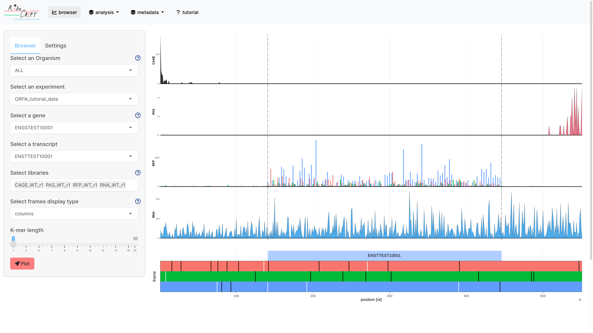

# Introduction

Welcome to the `RiboCrypt` package. 
`RiboCrypt` is an R package for interactive visualization in genomics. `RiboCrypt` works with any NGS-based method, but much emphasis is put on Ribo-seq data visualization. 

This vignette will walk you through usage with examples. 

`RibCrypt` currently supports creating interactive browser views for NGS tracks:

1. Coverage plots for RNA-seq or any other type of experiment
2. Sub-codon resolution display of ribo-seq p-shifted footprints. 3 reading frames can be displayed as:
  -lines
  -columns
  -stacked area
3. Coverage profiles smoothing via the use of sliding-window (k-mers)
4. Genome-transcriptome toggling, that is data display in genomic or transcriptomic context.
5. Animating between conditions, replicates, readlengths, sliding window width or any other parameter.

# Introduction to Ribo-seq

If you're not familiar with terms like "p-shifting" or "p-site offset", it's best to walk through ORFikOverview vignette, especially chapter 6 "RiboSeq footprints automatic shift detection and shifting"

https://bioconductor.org/packages/release/bioc/vignettes/ORFik/inst/doc/ORFikOverview.html#riboseq-footprints-automatic-shift-detection-and-shifting


# ORFik experiments

A structure of genome annotation and sequencing libraries in RiboCrypt is structured around the
ORFik experiment syntax. This syntax is required for the app, but not for standalone function calls outside the main app.

```{r eval = TRUE, echo = TRUE, message = FALSE}
library(RiboCrypt) # This package
library(ORFik)     # The backend package for RiboCrypt
```

Now load the experiment and load the coding sequences (cds). Here, we use ORFik experiment data structure, to familiarize yourself with the concept check the ORFikExperiment vignette:

https://bioconductor.org/packages/release/bioc/vignettes/ORFik/inst/doc/ORFikExperiment.html

```{r eval = TRUE, echo = TRUE, message = FALSE}
 df <- ORFik.template.experiment()
 cds <- loadRegion(df, "cds")
 cds # gene annotation
 df # let's look at libraries the experiment contains

```
We can see that the experiment consists of CAGE (5'ends), PAS (3'ends), RNA-seq and Ribo-seq libraries in wild-type and mutant conditions.

ORFik experiment can by subsetted either by index or by column. It will be useful to pick libraries to display.
```{r eval = TRUE, echo = TRUE, message = FALSE}
df[4:6,]
df[which(df$libtype == "CAGE"),]
df[which(df$condition == "Mutant"),]

```

# Interactive app

## Data for app
Let us recreate the ORFik tutorial sample and populate it into your local
experiment folder, found at location:  `ORFik::config()["exp"]`
```{r eval = TRUE, echo = TRUE, message = FALSE}
  dir <- system.file("extdata/Homo_sapiens_sample", "", package = "ORFik")
  # 2. Pick an experiment name
  exper <- "ORFik_tutorial_data"
  # 3. Pick .gff/.gtf location
  txdb <- system.file("extdata/Homo_sapiens_sample", "Homo_sapiens_dummy.gtf.db", package = "ORFik")
  fa <- system.file("extdata/Homo_sapiens_sample", "Homo_sapiens_dummy.fasta", package = "ORFik")
  all_experiments_dir <- ORFik::config()["exp"] # <- Here they are 
  template <- create.experiment(dir = dir, saveDir = all_experiments_dir,
                                exper, txdb = txdb, fa = fa,
                                organism = "Homo sapiens simulated",
                                author = "Simulated by ORFik", types = "ofst")

```

## App Format optimizations

Bigwig are very fast formats to reads when read length information is not needed, let us convert the libraries to bigwig.

```{r eval = TRUE, echo = TRUE, message = FALSE}
convert_to_bigWig(df)
```

## Running the app
To start the app you need data, structured through ORFik experiments. For this demonstration let's just copy
the ORFik experiment example over to your hard drive as a dummy set:

```{r eval = FALSE, echo = TRUE, message = FALSE}
# Just set some settings for this tutorial to look cool, usually you can ignore these
browser_options <- c(default_frame_type = "columns", default_experiment = "ORFik_tutorial_data", default_libs = paste0(c("CAGE_WT_r1", "PAS_WT_r1", "RFP_WT_r1", "RNA_WT_r1"), collapse = "|"), plot_on_start = TRUE)

RiboCrypt_app(browser_options = browser_options)
```



You will now have the app running in your default browser. 
For more details, see the RiboCrypt app tutorial, which is included
inside the app itself and on bioconductor as a vignette. 

# Creating browser window

Browser window is created with `multiOmicsPlot` functions. The function displays libraries subsetted from experiment (df) from top to down. First, lets have a look at a single library of each type (cds is extended by 30 bases). In the resulting plot you can zoom in and inspect coverage:

```{r eval = TRUE, echo = TRUE, message = FALSE}

  multiOmicsPlot_ORFikExp(extendLeaders(extendTrailers(cds[3], 30), 30), annotation = cds,df = df[c(1,5,9,13),],
                        frames_type = "columns", custom_motif = "CTG")
 
```

From top to down, we see Ribo-seq coverage, displayed as columns with the three frames color-coded according to the bottom panel: the three rectangles represent reading frames with sequence features denoted by vertical lines: white for AUG codons and black for stop codons. Custom motifs can be displayed in purple with custom_motif argument. Middle panel is gene model schematic, note that cds frame is also color-coded to match reading frame.

Now, we can plot just the ribosome footprints (RFPs), with display changed to lines, instead of columns:

```{r eval = TRUE, echo = TRUE, message = FALSE}

  multiOmicsPlot_ORFikExp(extendLeaders(extendTrailers(cds[3], 30), 30), annotation = cds,df = df[which(df$libtype == "RFP")[1],],
                        frames_type = "lines")
 
```

Line display is intuitive, but Ribo-seq coverage tends to be very serrated - lines overlap and the whole picture is blurry. To aid that, you can use kmers argument, applying sliding window (sum or mean) over each frame, decreasing resolution and allowing for clearer separation of the three lines. It's also useful when significantly zoomed out:

```{r eval = TRUE, echo = TRUE, message = FALSE}

  multiOmicsPlot_ORFikExp(extendLeaders(extendTrailers(cds[3], 30), 30), annotation = cds,df = df[which(df$libtype == "RFP")[1],],
                        frames_type = "lines", kmers = 6)
 
```

We can now explore the stacked area reading frame display. It's especially useful for small figure generation: lines or columns may be indistinguishable when plot is reduced to very small dimensions for publication purposes, when stacked area should be well visible even when zoomed-out significantly. Note the camera icon in top-right panel. It allows for static image download. By default it's svg, allowing for vector graphics support and high-quality figure generation.

```{r eval = TRUE, echo = TRUE, message = FALSE}

  multiOmicsPlot_ORFikExp(extendLeaders(extendTrailers(cds[3], 30), 30), annotation = cds,df = df[which(df$libtype == "RFP")[1],],
                        frames_type = "stacks", kmers = 6)
 
```

# Conclusion

RiboCrypt offers interactive NGS profile display with several additional visualization methods designed for Ribo-seq specifically. Other utilities include kmers smoothing and static vector graphics export which for publication-grade figures generation.

