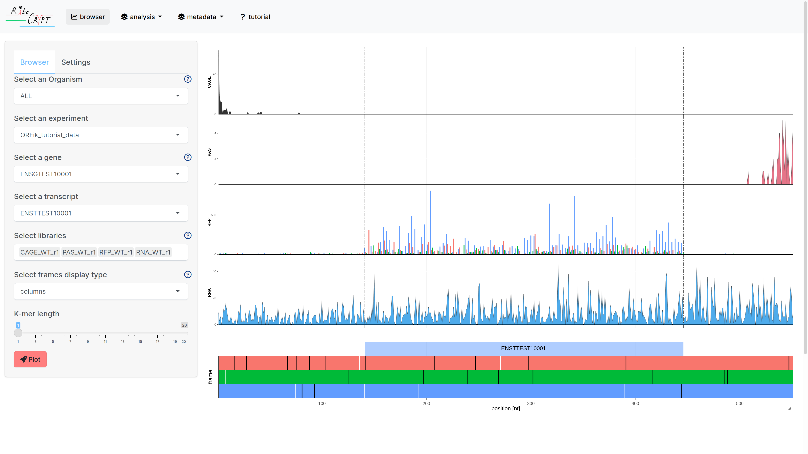

# Introduction

`RiboCrypt` provides interactive sequencing-coverage views, with particular
support for ribosome profiling and RNA-seq. The Browser shows individual
libraries, reading frames, sequence and annotations. MegaBrowser compares
precomputed collections, while Observatory helps define library groups for
merged-track comparisons.

This overview first introduces ORFik example data, then shows how to launch
the app and choose a workflow. It finishes with standalone plotting from R.
For step-by-step controls and analysis methods, use the
[complete app tutorial](RiboCrypt_app_tutorial.html).

# Introduction to Ribo-seq

If P-site offsets or footprint shifting are unfamiliar, start with the
[ORFik ribosome-footprint tutorial](https://bioconductor.org/packages/release/bioc/vignettes/ORFik/inst/doc/ORFikOverview.html#riboseq-footprints-automatic-shift-detection-and-shifting).

# ORFik experiments

An ORFik experiment connects library files, sample information, a reference
genome and transcript annotations. The app uses this structure to discover
and load datasets. Some standalone plotting functions can instead accept
coverage and annotation objects directly.

```{r eval = TRUE, echo = TRUE, message = FALSE}
library(RiboCrypt) # This package
library(ORFik)     # The backend package for RiboCrypt
```

Load the supplied example experiment and its coding sequences (CDS). See the
[ORFik experiment vignette](https://bioconductor.org/packages/release/bioc/vignettes/ORFik/inst/doc/ORFikExperiment.html)
for the experiment format and setup with your own data.

```{r eval = TRUE, echo = TRUE, message = FALSE}
 df <- ORFik.template.experiment()
 cds <- loadRegion(df, "cds")
 cds # gene annotation
 df # let's look at libraries the experiment contains

```
We can see that the experiment consists of CAGE (5'ends), PAS (3'ends), RNA-seq and Ribo-seq libraries in wild-type and mutant conditions.

Subset an experiment by row index or metadata to choose libraries for a plot:
```{r eval = TRUE, echo = TRUE, message = FALSE}
df[4:6,]
df[which(df$libtype == "CAGE"),]
df[which(df$condition == "Mutant"),]

```

# Interactive app

## Register example data

The app discovers experiments registered in `ORFik::config()["exp"]`.
Run the following setup once to register the supplied sample under a local
name. This chunk is not executed when building the vignette, because
registration writes to your experiment directory.

```{r eval = FALSE, echo = TRUE, message = FALSE}
  dir <- system.file("extdata/Homo_sapiens_sample", "", package = "ORFik")
  # Choose a local experiment name.
  exper <- "ORFik_tutorial_data"
  # Reuse the example's annotation and reference sequence.
  txdb <- df@txdb
  fa <- df@fafile
  all_experiments_dir <- ORFik::config()["exp"] # <- Here they are 
  template <- create.experiment(dir = dir, saveDir = all_experiments_dir,
                                exper, txdb = txdb, fa = fa,
                                organism = "Homo sapiens simulated",
                                author = "Simulated by ORFik", types = "ofst")
  df <- read.experiment(exper)

```

## Prepare coverage for local browsing

For your own libraries, bigWig files provide fast coverage access when read
length information is not needed. Conversion writes coverage files, so run
it explicitly on an experiment you want to prepare; it is not part of this
vignette's build. MegaBrowser requires separate precomputed collection files,
not merely these bigWigs.

```{r coverage-conversion, eval = FALSE, echo = TRUE, message = FALSE}
convert_to_bigWig(df)
```

## Running the app
After registering the sample, start the app with that experiment selected:

```{r eval = FALSE, echo = TRUE, message = FALSE}
browser_options <- c(
    default_frame_type = "columns",
    default_experiment = "ORFik_tutorial_data",
    default_libs = paste(c("CAGE_WT_r1", "PAS_WT_r1", "RFP_WT_r1", "RNA_WT_r1"),
                        collapse = "|"),
    plot_on_start = "TRUE"
)

RiboCrypt_app(browser_options = browser_options)
```



The app opens in your browser during an interactive R session. Available
studies, annotations and pages depend on the registered data. The sample
supports the Browser examples below; it does not contain the collection
coverage and predicted-translon files needed for the full MegaBrowser workflow.

## Choose an app workflow

| Workflow | Starting point and purpose |
|---|---|
| Browser | Select libraries and a gene to inspect coverage, sequence and reading frames. Set manual Y-axis limits or local Y-axis scaling on zoom, and download the displayed coverage. |
| MegaBrowser | Select an all-samples collection and gene, then generate a heatmap to compare and cluster library profiles. |
| Observatory | Use the linked UMAP and metadata table to define library groups, then compare their merged coverage in Browse. |
| Translons | Search a prediction study, simplify the visible columns or download the prediction table. |

### Explore a collection with MegaBrowser

Start with a collection providing per-gene coverage, metadata and library-size
tables. Choose a gene/transcript, region, normalization, count threshold and
grouping, then **Generate Plot**. The heatmap retains individual libraries for
clustering and analysis; optional **Collapsed clusters** displays one mean row
per existing group. **Visible groups**, sidebar visibility, heatmap-only mode,
plot height and reset zoom controls change the view without reclustering.
**Collapse translons** displays unique CDS/translon and user-defined regions as
equal-width columns in transcript order, preferring clean CDS over its parent
CDS. Libraries show mean raw coverage per nucleotide. With **Collapsed clusters**
also enabled, colours instead show each cluster's log2 fold change relative to
that region's library-weighted full-analysis mean, so weak regions are not
masked by strongly covered ones. Raw densities and exact fold changes remain
in hover text; colours saturate at 0.5x/2x. This descriptive display does not
change the full-matrix clustering or statistics. Click a region cell to inspect
individual-library distributions, export its libraries or compare region/clean-CDS
log2 ratios by a metadata field, retaining raw ratios in library exports.
The exploratory table reports support and study
representation as well as rank statistics; it is not study-adjusted evidence.
Editable low-support markers leave values and analyses unchanged.

The three main tabs are **Heatmap**, **Factor enrichment** and **Translon
enrichment**. Next choose the question you want to explore:

- Within **Factor enrichment**, **Group summary** describes the visible groups: metadata modes and agreement,
  numeric summaries, library counts and membership CSV exports.
- Its **Enrichment** and **Statistics** sub-tabs assess metadata patterns in the full
  count-filtered library set. Switch **Enrichment metadata**, for example to
  `CELL_LINE`, without recomputing coverage or clusters.
  **Result table** provides the corresponding library records and result filters.
- **Translon enrichment** compares CDS and translon coverage. Enable T/TC
  annotations and generate the plot first; analysis starts only when this page
  is opened. It deduplicates complete interval sets, retains their source aliases
  and makes `clean_cds` by excluding overlapping upstream-ORF bases. Per-library
  raw coverage-density ratios are summarized by group with distributions,
  medians/IQRs, exploratory rank effects and BH-adjusted tests. Ratios, statistics
  and interval definitions can be downloaded as CSV.
  In **Regions**, click **+** to add an interval with an editable default label
  (`UR1`, `UR2`, etc.). Coordinates are one-based and inclusive: `40:80` is a
  range, while `40` and `40:40` both select one nucleotide. Reversed or out-of-range
  coordinates produce a validation message. Added regions receive sequential
  region IDs, participate in all comparisons and exports, and reset on a new
  analysis; they do not change annotation-derived clean CDS regions.

Collapsed rows are display summaries, not independent samples. Display focus
affects the heatmap and Group summary but does not reduce metadata/translon
enrichment to the visible groups. Translon ratios use raw unbinned coverage,
not the normalized/log-scaled heatmap; zero denominators remain undefined
without a pseudocount. The tests are exploratory because the same coverage
defines clusters and libraries can share studies or biological samples.

The [MegaBrowser chapter](RiboCrypt_app_tutorial.html#mbrowser) gives the complete
workflow, export scopes and a human ATF4 example with T/TC duplicate predictions
and an overlapping uORF. Prediction files and precomputed transcript coverage
must be present for that example; results depend on the collection used.

# Plotting directly from R

The app is not required for standalone Browser plots. Return to the example
experiment loaded above and use `multiOmicsPlot_ORFikExp()` to display its
libraries. These examples demonstrate the Browser's coverage/reading-frame
views, not MegaBrowser clustering or translon enrichment.

First, display one library of each type, extending the CDS by 30 bases on
each side. The libraries appear from top to bottom; zoom in to inspect their
coverage and reading frames:

```{r eval = TRUE, echo = TRUE, message = FALSE}

  multiOmicsPlot_ORFikExp(extendLeaders(extendTrailers(cds[3], 30), 30), annotation = cds,df = df[c(1,5,9,13),],
                        frames_type = "columns", custom_motif = "CTG")
 
```

From top to down, we see Ribo-seq coverage, displayed as columns with the three frames color-coded according to the bottom panel: the three rectangles represent reading frames with sequence features denoted by vertical lines: white for AUG codons and black for stop codons. Custom motifs can be displayed in purple with custom_motif argument. Middle panel is gene model schematic, note that cds frame is also color-coded to match reading frame.

Now, we can plot just the ribosome footprints (RFPs), with display changed to lines, instead of columns:

```{r eval = FALSE, echo = TRUE, message = FALSE}

  multiOmicsPlot_ORFikExp(extendLeaders(extendTrailers(cds[3], 30), 30), annotation = cds,df = df[which(df$libtype == "RFP")[1],], frames_type = "lines")
 
```

Line display is intuitive, but Ribo-seq coverage tends to be very serrated - lines overlap and the whole picture is blurry. To aid that, you can use kmers argument, applying sliding window (sum or mean) over each frame, decreasing resolution and allowing for clearer separation of the three lines. It's also useful when significantly zoomed out:

```{r eval = TRUE, echo = TRUE, message = FALSE}

  multiOmicsPlot_ORFikExp(extendLeaders(extendTrailers(cds[3], 30), 30), annotation = cds,df = df[which(df$libtype == "RFP")[1],],
                        frames_type = "lines", kmers = 6)
 
```

We can now explore the stacked area reading frame display. It's especially useful for small figure generation: lines or columns may be indistinguishable when plot is reduced to very small dimensions for publication purposes, when stacked area should be well visible even when zoomed-out significantly. Note the camera icon in top-right panel. It allows for static image download. By default it's svg, allowing for vector graphics support and high-quality figure generation.

```{r eval = TRUE, echo = TRUE, message = FALSE}

  multiOmicsPlot_ORFikExp(extendLeaders(extendTrailers(cds[3], 30), 30), annotation = cds,df = df[which(df$libtype == "RFP")[1],],
                        frames_type = "stacks", kmers = 6)
 
```

# Conclusion

Use the Browser or standalone functions for detailed library-level inspection,
MegaBrowser for collection-wide profiles and group comparisons, and Observatory
for custom merged-library comparisons. The
[app tutorial](RiboCrypt_app_tutorial.html) expands these workflows with controls,
data requirements, export options and statistical interpretation.
